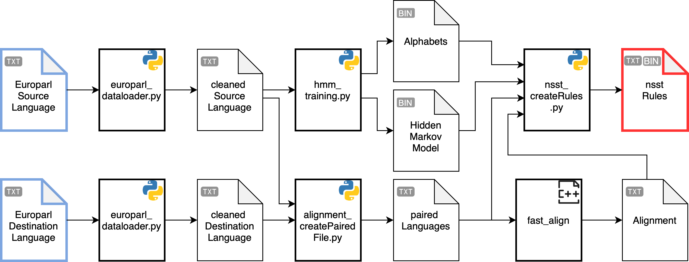

# Nondeterministic Streaming String Transducer

## Dependencies
- fast_align
- python >= 3.6
- hmmlearn >= 0.2.3
- scikit-learn
- numpy
- tensorboardX
- tqdm
- nltk >= 3.5
- pyter3

## Files

## Run
